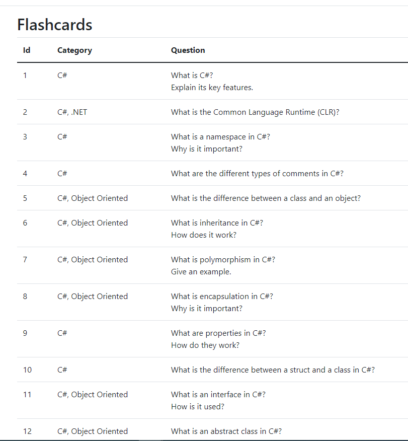
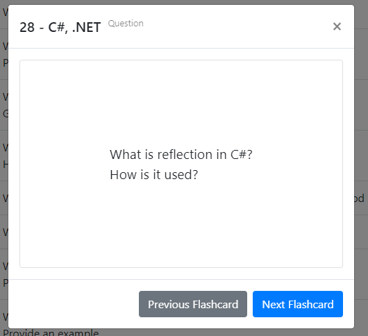

# Flashcards App


## Overview
Flashcards App is a web application built with ASP.NET Core MVC for studying and reviewing flashcards. Users can start a random game, view specific flashcards by ID, and navigate between flashcards.

## Features
- View flashcards in a table
- Start a random game
- Start a game from a specific flashcard ID
- Navigate between flashcards within the modal
- Flip flashcards to view the answer

## Technologies
- ASP.NET Core MVC
- JavaScript
- HTML/CSS
- Bootstrap

## Installation

1. Clone the repository:
    ```bash
    git clone https://github.com/iair007/flashcards-app.git
    ```
2. Navigate to the project directory:
    ```bash
    cd flashcards-app
    ```
3. Restore the dependencies:
    ```bash
    dotnet restore
    ```
4. Build the project:
    ```bash
    dotnet build
    ```
5. Run the application:
    ```bash
    dotnet run
    ```

## Usage
1. Navigate to `http://localhost:5000` in your web browser.
2. View the flashcards table on the main page.
3. Use the "Start Random Game" button to start reviewing flashcards randomly.
4. Use the "Start Game from ID" button to start reviewing flashcards from a specific ID.
5. Navigate between flashcards using the "Next Flashcard" and "Previous Flashcard" buttons within the modal.

## Screenshots
<p align="center">
  
  
</p>

## Contributing
1. Fork the repository.
2. Create your feature branch:
    ```bash
    git checkout -b feature/YourFeature
    ```
3. Commit your changes:
    ```bash
    git commit -m 'Add some feature'
    ```
4. Push to the branch:
    ```bash
    git push origin feature/YourFeature
    ```
5. Open a pull request.

## License
This project is licensed under the MIT License - see the [LICENSE](LICENSE) file for details.

## Tags
- ASP.NET Core
- Flashcards
- Study
- Education
- Web Application
- JavaScript
- MVC
- Learning
- .NET

## Acknowledgements
- [Bootstrap](https://getbootstrap.com/)
- [jQuery](https://jquery.com/)

## Contact
- **Author**: Iair Kolberg
- **GitHub**: [iair007](https://github.com/iair007)
